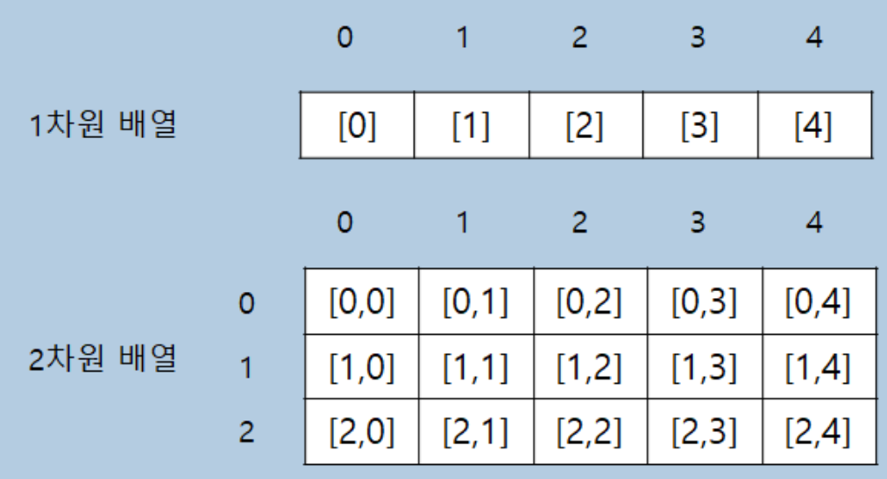

# 2022.12.11
프로그래머스 > 코딩테스트 입문 > [2차원으로 만들기](https://school.programmers.co.kr/learn/courses/30/lessons/120842)

## 
 내가 생각한 풀이과정 

1. 2차원의 배열 길이 할당
2. 1차원 배열의 값 할당

## 
 오늘의 느낀점 

2차원 배열에 1차원의 배열을 할당하는 방법을 생각하기 어려웠다. 
1차원의 배열의 인덱스를 0으로 초기화한후 For문에서 증가시켜서 할당

      public int[][] solution(int[] num_list, int n) {
        int[][] answer = new int[num_list.length/n][n];
            int temp = 0; 
        for(int j =0 ; j <num_list.length/n  ; j++){
            for(int i=0 ; i< n ; i++){
                answer[j][i] = num_list[temp];
                temp++;
            }
        }
        return answer;
      }

# 
 Check Point! 

### 1. 2차원 배열
     int[][] answer

    