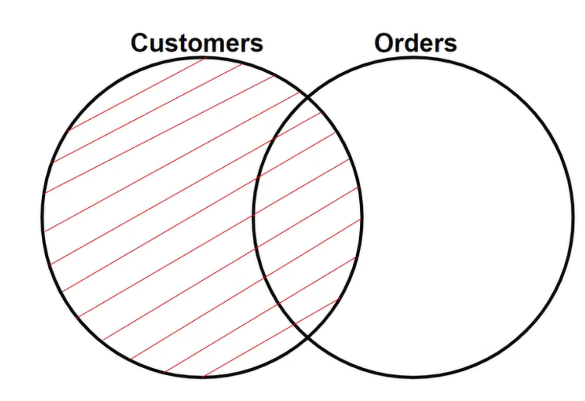

## 문제 
***
    테이블명(USED_GOODS_BOARD)
    BOARD_ID, WRITER_ID, TITLE, CONTENTS, PRICE, CREATED_DATE, STATUS, VIEWS
    게시글 ID, 작성자 ID, 게시글 제목, 게시글 내용, 가격, 작성일, 거래상태, 조회수
 

    테이블명(USED_GOODS_REPLY)
    REPLY_ID, BOARD_ID, WRITER_ID, CONTENTS, CREATED_DATE
    댓글 ID, 게시글 ID, 작성자 ID, 댓글 내용, 작성일

USED_GOODS_BOARD와 USED_GOODS_REPLY 테이블에서 2022년 10월에 작성된 게시글 제목, 게시글 ID, 댓글 ID, 댓글 작성자 ID, 댓글 내용, 댓글 작성일을 조회하는 SQL문을 작성해주세요. 결과는 댓글 작성일을 기준으로 오름차순 정렬해주시고, 댓글 작성일이 같다면 게시글 제목을 기준으로 오름차순 정렬해주세요.
 
## 정답 & 풀이과정
***
    SELECT A.TITLE, A.BOARD_ID, B.REPLY_ID, B.WRITER_ID, B.CONTENTS, DATE_FORMAT(B.CREATED_DATE, '%Y-%m-%d') as CREATED_DATE 
        FROM USED_GOODS_BOARD A, USED_GOODS_REPLY B
        WHERE A.BOARD_ID = B.BOARD_ID and DATE_FORMAT(A.CREATED_DATE, '%Y-%m-%d') = DATE_FORMAT(A.CREATED_DATE, '2022-10-%d')
        ORDER BY B.CREATED_DATE, A.TITLE
- 어느 컬럼을 선택할지 고르자
- 게시글의 ID랑 댓글 ID가 같은지, 2022-10에 작성된 게시글인지
- 댓글 작성일 오름차순, 게시글 제목 오름차순 정렬

## 다른 풀이과정
    SELECT A.TITLE, A.BOARD_ID, B.REPLY_ID, B.WRITER_ID, B.CONTENTS, DATE_FORMAT(B.CREATED_DATE, '%Y-%m-%d') AS CREATED_DATE
        FROM USED_GOODS_BOARD A
        JOIN USED_GOODS_REPLY B
        ON A.BOARD_ID = B.BOARD_ID
        AND A.CREATED_DATE BETWEEN '2022-10-01' AND '2022-10-31'
        ORDER BY B.CREATED_DATE ASC, A.TITLE ASC

## 
 오늘의 느낀점 

게시글의 작성일이 아니라 댓글의 작성일로 해서 계속 오류가 났다. 
여전히 문제를 주의 깊게 자세히 읽지 않는 문제 생김. 
JOIN으로도 표시 가능 

# 
 Check Point! 

### 1. JOIN(INNNER JOIN, LEFT JOIN), ON(조건절)
    1-1. SELECT 열 이름 FROM 테이블명A
             INNER JOIN 테이블명B
             ON B.Key = A.Key;

테이블A와 테이블B 중 Key 값이 같은 정보를 모두 합치기

    1-2. SELECT C.CustomerID, O.OrderID
             FROM Customers AS C
             LEFT JOIN Orders AS O
             ON O.CustomerID = C.CustomerID
Customers는 그대로 놔두고, Orders는 교집합부분을 가져온다.

 

      
