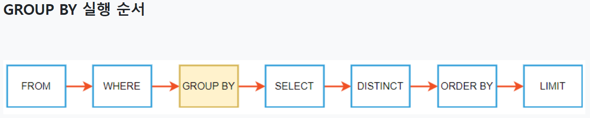

## 문제
***
    테이블명(REST_INFO)
    REST_ID, REST_NAME, FOOD_TYPE, VIEWS, FAVORITES, PARKING_LOT, ADDRESS, TEL
    식당 ID, 식당 이름, 음식 종류, 조회수, 즐겨찾기수, 주차장 유무, 주소, 전화번호

    테이블명(REST_REVIEW)
    REVIEW_ID, REST_ID, MEMBER_ID, REVIEW_SCORE, REVIEW_TEXT,REVIEW_DATE
    리뷰 ID, 식당 ID, 회원 ID, 점수, 리뷰 텍스트, 리뷰 작성일

REST_INFO와 REST_REVIEW 테이블에서 서울에 위치한 식당들의 식당 ID, 식당 이름, 음식 종류, 즐겨찾기수, 주소, 리뷰 평균 점수를 조회하는 SQL문을 작성해주세요. 이때 리뷰 평균점수는 소수점 세 번째 자리에서 반올림 해주시고 결과는 평균점수를 기준으로 내림차순 정렬해주시고, 평균점수가 같다면 즐겨찾기수를 기준으로 내림차순 정렬해주세요.
 
## 정답 & 풀이과정
***
    SELECT I.REST_ID, I.REST_NAME, I.FOOD_TYPE, I.FAVORITES, I.ADDRESS, ROUND(AVG(R.REVIEW_SCORE),2) as SCORE 
        FROM REST_INFO I
        JOIN REST_REVIEW R
        on I.REST_ID = R.REST_ID
        WHERE I.ADDRESS LIKE '서울%'
        GROUP BY I.REST_ID 
        ORDER BY SCORE DESC, I.FAVORITES DESC

- 어느 컬럼을 선택할지 고르자
- 두 테이블 컬럼 합치기
- 식당주소가 서울인 조건
- 식당ID로 그룹화
- 평균점수, 즐겨찾기 수 정렬

# 
 Check Point! 

### 1. HAVING & WHERE 차이
    WHERE랑 HAVING을 헷갈리는 경우가 많은데 WHERE는 그룹화 하기 전이고, HAVING은 그룹화 후에 조건입니다.

### 2. JOIN or LEFT JOIN
    LEFT JOIN을 선택했더니 score가 없는 경우가 포함되서 오답

### 3. ROUND,2
    3번째 자리에서 반올림이라해서 3으로 했지만 오답
    3번째 자리에서 반올림해서 두개까지만 보이게 하는 것

### 4. GROUP BY
    SELECT 문에서 집계 함수를 사용하는 경우 집계되지 않은 열을 그룹화하는 방법을 지정해야 합니다.

